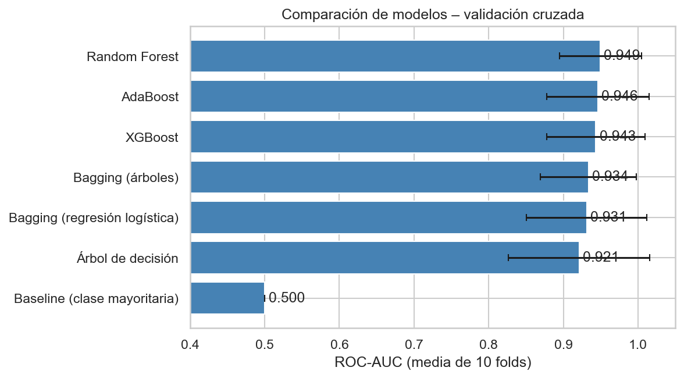
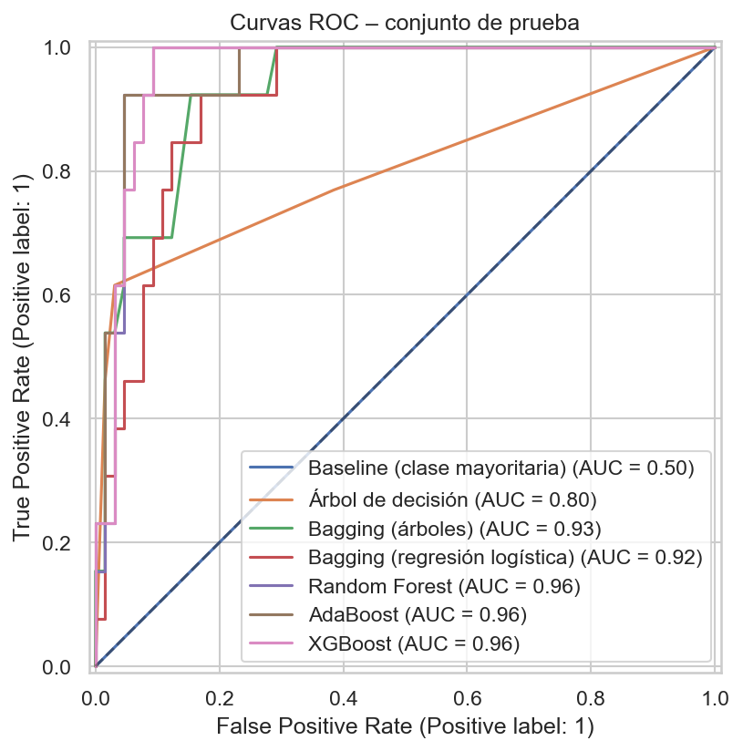
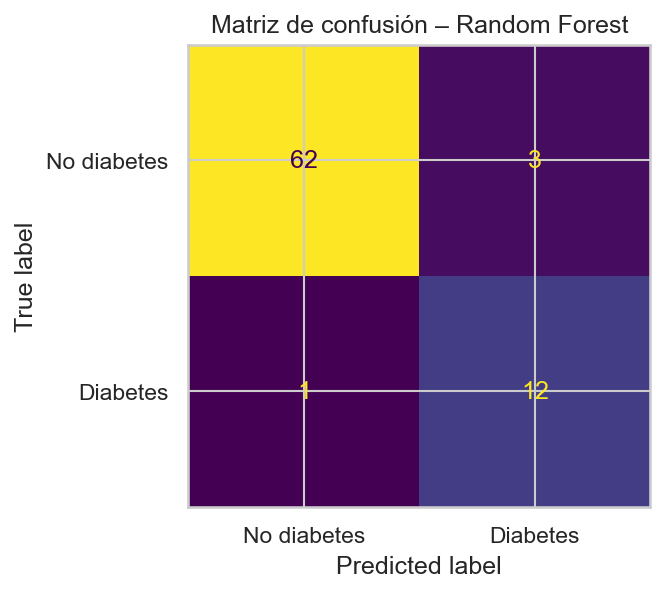
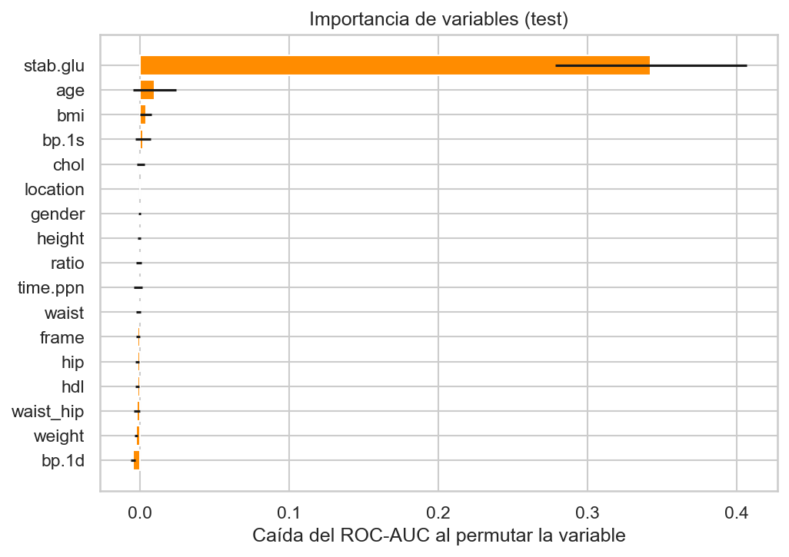

# Predicción de diabetes con árboles y métodos de ensamble

Proyecto 2 – Curso de Machine Learning · Universidad de Medellín

## 1. Problema
Clasificación binaria: predecir si un paciente tiene diabetes a partir de variables demográficas, antropométricas y de laboratorio (colesterol, glucosa, presión arterial, IMC, cintura/cadera, edad, sexo). El objetivo es apoyar el **tamizaje**: priorizar qué pacientes deberían realizarse la prueba confirmatoria (HbA1c).

> Proyecto académico. No sustituye el diagnóstico médico.

## 2. Dataset
- **Fuente:** [Diabetes – Kaggle (imtkaggleteam)](https://www.kaggle.com/datasets/imtkaggleteam/diabetes)
- **Archivo usado:** `data/Diabetes_Classification.csv` — 403 filas × 19 columnas en el archivo original; tras eliminar los 13 pacientes sin `glyhb` quedan **390 pacientes**.
- **Variable objetivo:** `Diabetes` (etiqueta derivada de la hemoglobina glicosilada: HbA1c ≥ 6.5 %). **65 pacientes diabéticos (16,7 %)** y 325 no diabéticos.
- **Variables descartadas:** identificador del paciente y `glyhb` (define la etiqueta → fuga de información).
- **Desbalance:** las clases están desbalanceadas, por lo que se usa **ROC-AUC** como métrica principal y se reportan también precision, recall y F1.

## 3. Solución propuesta
1. Análisis exploratorio (tipos, rangos, nulos, outliers, correlaciones, relación con la clase).
2. Partición estratificada 80 % entrenamiento / 20 % prueba.
3. Preprocesamiento dentro de un `Pipeline` (imputación + one-hot), para evitar fugas entre folds.
4. **Validación cruzada estratificada de 10 folds** con `GridSearchCV` para:
   - Árbol de decisión
   - Bagging (árboles y regresión logística)
   - Random Forest
   - AdaBoost
   - XGBoost
5. Comparación con un baseline, selección del mejor modelo por ROC-AUC en CV y evaluación final en el conjunto de prueba.
6. Modelo guardado con `joblib`.

## 4. Resultados
Comparación de los modelos (ordenados por ROC-AUC promedio en validación cruzada de 10 folds; el conjunto de prueba tiene 78 pacientes, 13 de ellos diabéticos):

| Modelo | CV ROC-AUC | Test ROC-AUC | Test Recall | Test F1 |
|---|---|---|---|---|
| **Random Forest** | **0.949** | **0.964** | **0.923** | **0.857** |
| AdaBoost | 0.946 | 0.961 | 0.615 | 0.696 |
| XGBoost | 0.943 | 0.967 | 1.000 | 0.812 |
| Bagging (árboles) | 0.934 | 0.934 | 0.538 | 0.636 |
| Bagging (regresión logística) | 0.931 | 0.918 | 0.308 | 0.444 |
| Árbol de decisión | 0.921 | 0.801 | 0.615 | 0.696 |
| Baseline (clase mayoritaria) | 0.500 | 0.500 | 0.000 | 0.000 |

<details>
<summary>Tabla completa de métricas (CV y prueba)</summary>

| Modelo | CV ROC-AUC | ± std | CV Accuracy | CV Precision | CV Recall | CV F1 | Test ROC-AUC | Test Accuracy | Test Precision | Test Recall | Test F1 |
|---|---|---|---|---|---|---|---|---|---|---|---|
| Random Forest | 0.949 | 0.055 | 0.904 | 0.742 | 0.700 | 0.708 | 0.964 | 0.949 | 0.800 | 0.923 | 0.857 |
| AdaBoost | 0.946 | 0.069 | 0.914 | 0.852 | 0.600 | 0.689 | 0.961 | 0.910 | 0.800 | 0.615 | 0.696 |
| XGBoost | 0.943 | 0.067 | 0.895 | 0.665 | 0.800 | 0.718 | 0.967 | 0.923 | 0.684 | 1.000 | 0.812 |
| Bagging (árboles) | 0.934 | 0.064 | 0.920 | 0.868 | 0.620 | 0.713 | 0.934 | 0.897 | 0.778 | 0.538 | 0.636 |
| Bagging (regresión logística) | 0.931 | 0.081 | 0.885 | 0.875 | 0.347 | 0.480 | 0.918 | 0.872 | 0.800 | 0.308 | 0.444 |
| Árbol de decisión | 0.921 | 0.095 | 0.920 | 0.837 | 0.660 | 0.729 | 0.801 | 0.910 | 0.800 | 0.615 | 0.696 |
| Baseline (clase mayoritaria) | 0.500 | 0.000 | 0.833 | 0.000 | 0.000 | 0.000 | 0.500 | 0.833 | 0.000 | 0.000 | 0.000 |

</details>

**Mejor modelo:** Random Forest (seleccionado por ROC-AUC en CV = 0.949 ± 0.055; ROC-AUC en prueba = 0.964) con hiperparámetros:

| Hiperparámetro | Valor |
|---|---|
| `n_estimators` | 300 |
| `max_depth` | 5 |
| `max_features` | 0.5 |
| `min_samples_leaf` | 3 |
| `class_weight` | `balanced_subsample` |

**Desempeño del mejor modelo en el conjunto de prueba (umbral 0.5):**

| Clase | Precision | Recall | F1 | Soporte |
|---|---|---|---|---|
| No diabetes | 0.98 | 0.95 | 0.97 | 65 |
| Diabetes | 0.80 | 0.92 | 0.86 | 13 |

Accuracy global: 0.95.









## 5. Conclusiones

- **Random Forest** fue el modelo seleccionado, con ROC-AUC promedio de **0.949 ± 0.055** en validación cruzada y **0.964** en prueba. Su desempeño combina una alta capacidad de discriminación con un *recall* de **0.923** para los casos de diabetes, una propiedad importante en un escenario de tamizaje.
- Los métodos de ensamble superaron al árbol de decisión individual. En particular, Random Forest, AdaBoost y XGBoost lograron valores de ROC-AUC en prueba entre **0.961** y **0.967**, frente a **0.801** del árbol, lo que evidencia que combinar modelos reduce la variabilidad y mejora la generalización.
- XGBoost obtuvo el ROC-AUC más alto en el conjunto de prueba (**0.967**) y detectó todos los casos positivos (*recall* = **1.000**); sin embargo, Random Forest se eligió por su resultado más sólido y equilibrado en validación cruzada, evitando decidir únicamente a partir de un único conjunto de prueba pequeño.
- La importancia por permutación permite identificar las variables que más aportan a la predicción sin incluir `glyhb`, que se excluyó para prevenir fuga de información. Esto hace que el modelo se base en información disponible antes de una prueba confirmatoria de HbA1c.
- Los resultados deben interpretarse con cautela: el conjunto final contiene solo **390 pacientes** y **65 casos positivos**, existe desbalance de clases y los datos proceden de una población específica. Por ello, el modelo no debe utilizarse como diagnóstico clínico ni asumirse generalizable a otras poblaciones sin validación externa.
- Como trabajo futuro, se recomienda validar el enfoque con una cohorte independiente y más diversa, evaluar la calibración de las probabilidades, ajustar el umbral de decisión según el costo de falsos negativos y falsos positivos, y complementar la evaluación con métricas como sensibilidad, especificidad y curvas de precisión-recall.

## 6. Cómo reproducirlo
```bash
pip install -r requirements.txt
jupyter notebook Proyecto2_Diabetes_ML.ipynb
```

Cargar el modelo guardado:
```python
import joblib, pandas as pd
modelo = joblib.load("models/mejor_modelo.joblib")
modelo.predict_proba(nuevos_pacientes)[:, 1]   # DataFrame con las mismas columnas de entrada
```

## 7. Estructura del repositorio
```
├── data/Diabetes_Classification.csv
├── Proyecto2_Diabetes_ML.ipynb
├── models/mejor_modelo.joblib
├── images/                      # gráficas de resultados
├── requirements.txt
└── README.md
```

## Autores
Andres Monsalve - Juan Lagares – William Osorio - Universidad de Medellín
